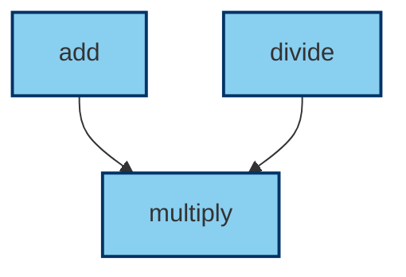
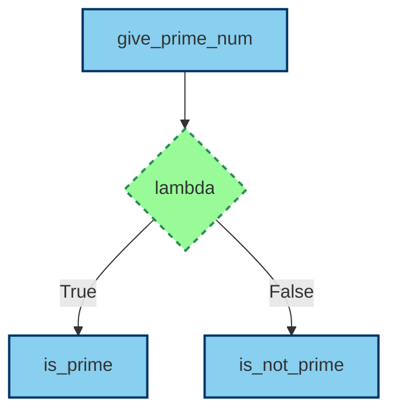
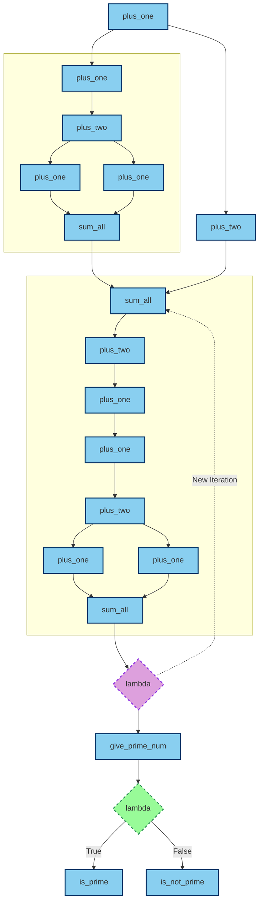

# StreamGraph

StreamGraph is a Python library designed for creating and managing chains of function nodes. This library provides an easy-to-use framework for chaining together functions, layers, and complex processing chains, enabling parallel processing and modular code organization.

## Features

- **Node Decorator**: Convert functions into nodes that can be added to chains.
- **Chain**: Create sequential chains of nodes for step-by-step processing.
- **Layer**: Parallel processing of nodes, either as a list or a dictionary.
- **Automatic Argument Handling**: Automatically manage and pass arguments between nodes.
- **Parallel Processing**: Utilize multiple CPU cores for parallel node execution.
- **Flexible Chain Operations**: Use `>>` and `<<` operators to create complex chains and systems.

## Installation

Install StreamGraph directly from GitHub using pip:

```bash
pip install git+https://github.com/lf-data/streamgraph.git
```

## Examples

### 1. Basic Example with Math Operations

```python
from streamgraph import node

@node()
def add(a, b):
    return a + b

@node()
def divide(a, b):
    return a/b

@node()
def multiply(a, b):
    return a * b

chain = [add, divide] >> multiply
chain.show()
```



### 2. ConditionalNode to check prime number

```python
from streamgraph import node, IfNode

@node()
def give_prime_num(n):
    if n <= 3:
        return n > 1
    if n % 2 == 0 or n % 3 == 0:
        return False
    i = 5
    while i ** 2 <= n:
        if n % i == 0 or n % (i + 2) == 0:
            return False
        i += 6
    return True

@node()
def is_prime():
    return "This number is prime"

@node()
def is_not_prime():
    return "This number is not prime"

check_prime_node = IfNode(lambda x: x, true_node=is_prime, false_node=is_not_prime)

chain = give_prime_num >> check_prime_node
chain.show()
```




### 3. Complex chain with nodes repeated several times

```python
from streamgraph import node, IfNode, LoopNode

@node()
def plus_one(num: int):
    return num + 1

@node()
def plus_two(num: int):
    return num + 2

@node()
def sum_all(*args):
    return sum(args)

@node()
def give_prime_num(n):
    print(n)
    if n <= 3:
        return n > 1
    if n % 2 == 0 or n % 3 == 0:
        return False
    i = 5
    while i ** 2 <= n:
        if n % i == 0 or n % (i + 2) == 0:
            return False
        i += 6
    return True

@node()
def is_prime():
    return "This number is prime"

@node()
def is_not_prime():
    return "This number is not prime"

check_prime_node = IfNode(lambda x: x, true_node=is_prime, false_node=is_not_prime)
base_chain = plus_one >> plus_two >> [plus_one, plus_one] >> sum_all
intermediate_chain = base_chain << plus_one << plus_two << sum_all
loop_node = LoopNode(lambda x: x >= 100, loop_node=intermediate_chain)
chain = plus_one >> [base_chain, plus_two] >> loop_node >> give_prime_num >> check_prime_node
chain.show()
```




## Contributing

Contributions are welcome! Please submit a pull request or open an issue to discuss your changes.

## License

This project is licensed under the MIT License. See the LICENSE file for details.
